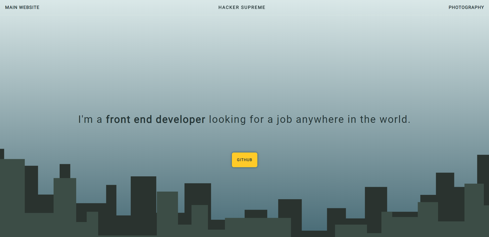

# React Spring Mouse Parallax Landing Page

Simple landing page that uses a mouse parallax. The parallax is powered by the animation library React Spring. Check out my [documentation](https://github.com/hackersupreme/mouse-parallax-example-documentation) on how you can use the library to achieve a mouse parallax effect.

On this page the two city skylines scale at different rates creating a neat zoom effect when you move your mouse around. Imagine what good illustrators could do with this technology!



## Installation

This assumes you have the following installed:
  - node.js 
  - node package manager (npm)

Get both here: https://nodejs.org/

###### Instructions

1. Create file directory on your local device
2. Download files to that directory

_note: PNG images are for this document, not needed for the project_

3. Using a command line software, enter the directory
```
cd directory-name
```
4. Use npm install to get the node modules
```
npm install
```
5. Use npm start to start the server
```
npm start
```

## Resources / Contact Info

### Email

jeffgsch@gmail.com

### Website

http://hackersupreme.com

### Resources

- [Mouse Parallax React Spring Documentation](https://github.com/hackersupreme/mouse-parallax-example-documentation)
- [React Spring Mouse Parallax CodeSandbox Example](https://codesandbox.io/s/r5x34869vq?from-embed)
- [React Spring Official Docs](https://www.react-spring.io/)
- [React Spring useSpring Hook](https://www.react-spring.io/docs/hooks/use-spring)
